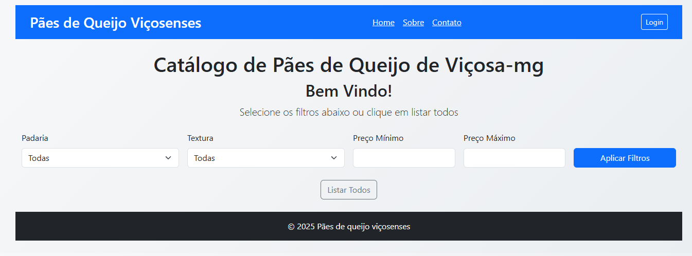
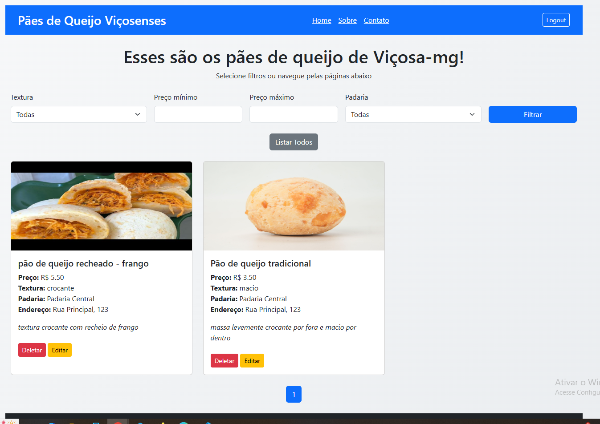
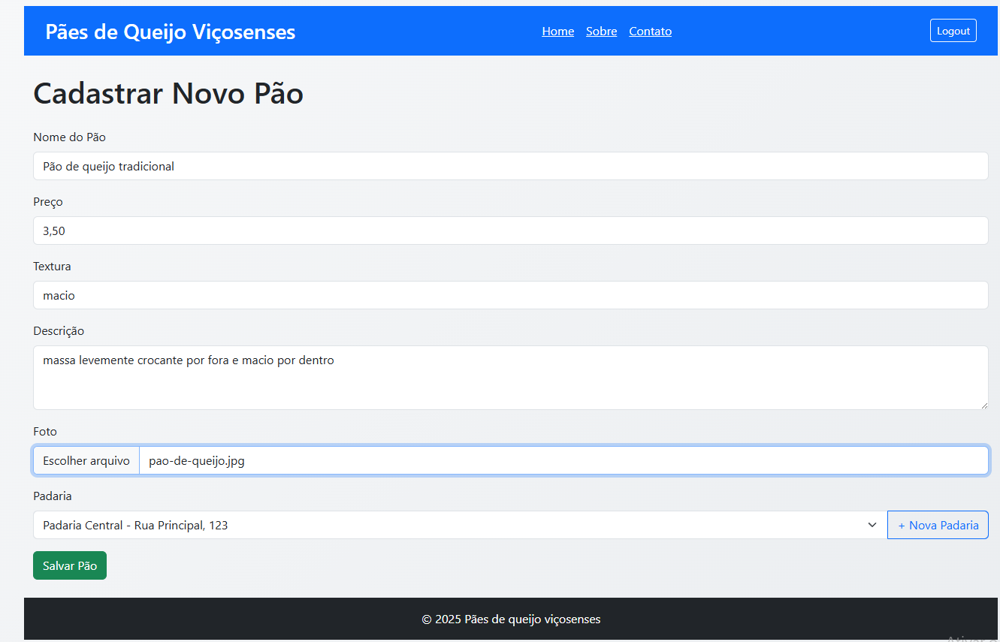
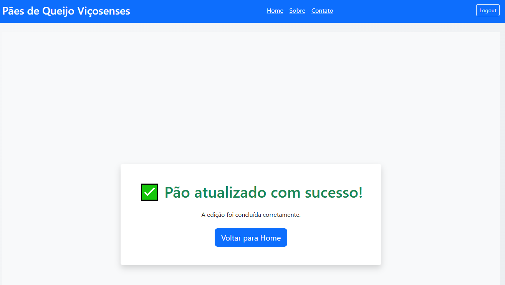

# Catálogo de Pães de Queijo Viçosenses

Uma aplicação web criada em **Node.js** para explorar, comparar e catalogar os pães de queijo das padarias de Viçosa-MG.


## Funcionalidades

- Listagem de pães de queijo por padaria
- Filtros avançados para busca
- Cadastro, edição e remoção de pães de queijo
- Upload de fotos dos pães
- Autenticação de usuários
- Interface responsiva com Bootstrap

## Tecnologias Utilizadas

- Node.js
- Express
- EJS (templating)
- Prisma ORM
- PostgreSQL (ou outro banco compatível)
- Bootstrap
- Helmet (segurança)
- Express-session (sessões)
- dotenv (variáveis de ambiente)

## Estrutura do Projeto


📁 catalogo-de-paes  
├── 📂 prisma   
├── 📂 public  
│   ├── 📂 css  
│   ├── 📂 icons  
│   └── 📂 js-scripts  
├── 📂 src  
│   ├── 📄 app.js  
│   ├── 📄 server.js  
│   ├── 📂 config  
│   ├── 📂 controllers  
│   ├── 📂 middleware  
│   ├── 📂 models  
│   ├── 📂 routes  
│   ├── 📂 services  
│   ├── 📂 tests  
│   ├── 📂 uploads  
│   ├── 📂 utils  
│   └── 📂 views  
│       ├── 📂 partials  
├── 📄 .env 
├── 📄 package.json  
└── 📄 README.md

## Imagens







## Instalação

1. Clone o repositório:
   ```sh
   git clone https://github.com/seu-usuario/catalogo-de-paes.git
   cd catalogo-de-paes
   ```
2.Instale as dependências:
   ```sh
   npm install
   ```
3. Configure o banco de dados no arquivo `.env`.

4. Execute as migrações do Prisma:
   ```sh
   npx prisma migrate deploy
   ```
   
5. Inicie o servidor:
   ```sh
   npm start
   ```
6. Acesse a aplicação em `http://localhost:3000`.

7. Para executar os testes end-to-end, use:
   ```sh
   npm run test:e2e
   ```


